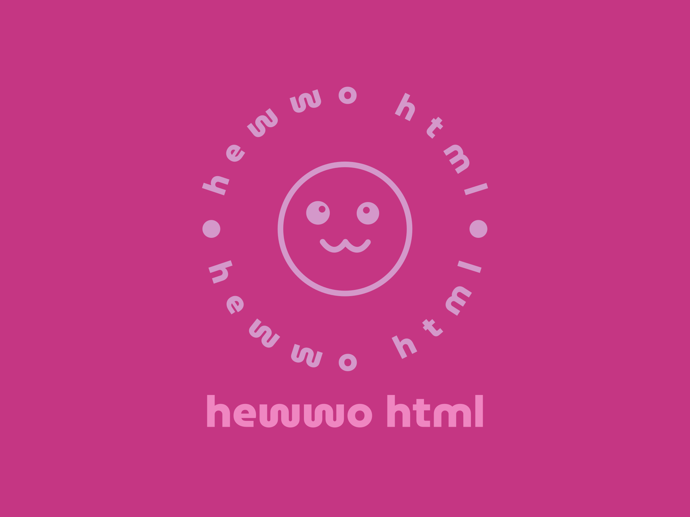

# Hewwo HTML
A simple but complete HTML/JS/CSS boilerplate generator.  

## Commands
`Ctrl/CMD+Shift+P` into the command palette and enter a command.  
- `Add boilerplate`: this will create three fresh files with basic boilerplate (HTML, JS, and CSS).
- `Create HTML file with boilerplate`: this will create an HTML file only.
- `Fill file with boilerplate`: this will fill your current file with the appropriate boilerplate code.

## License
This software is licensed under the Bok Choy General Software License. The full text of the license should be included below. If not, more information can be found at https://www.rockwill.dev/Bok-Choy-License/.

```
Bok Choy General Software License

Copyright (c) 2023 William Choi-Kim

This software and associated files (the "Software") may be used commercially, privately, and publicly. The Software may be modified in any way, without limitation. It may be distributed free of charge as is, but not distributed commerically without modifications to its functionality. Any distributed version of the Software must provide attribution to the Software in some way. Any distributed copy of the Software must abide by and include this license. The user is free to use, modify, and distribute the software under the aforementioned conditions.

THE SOFTWARE IS PROVIDED "AS IS", WITHOUT WARRANTY OF ANY KIND, EXPRESS OR IMPLIED, INCLUDING BUT NOT LIMITED TO THE WARRANTIES OF MERCHANTABILITY, FITNESS FOR A PARTICULAR PURPOSE AND NONINFRINGEMENT. IN NO EVENT SHALL THE AUTHORS OR COPYRIGHT HOLDERS BE LIABLE FOR ANY CLAIM, DAMAGES OR OTHER LIABILITY, WHETHER IN AN ACTION OF CONTRACT, TORT OR OTHERWISE, ARISING FROM, OUT OF OR IN CONNECTION WITH THE SOFTWARE OR THE USE OR OTHER DEALINGS IN THE SOFTWARE.
```